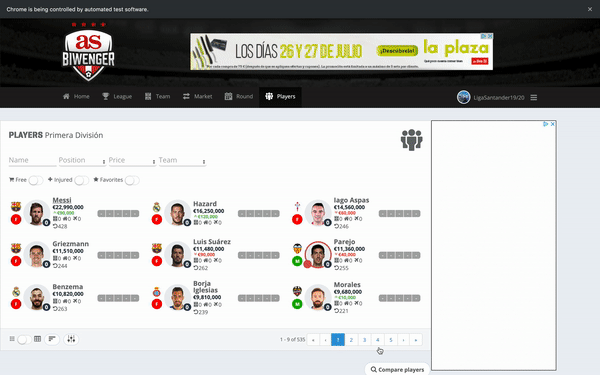
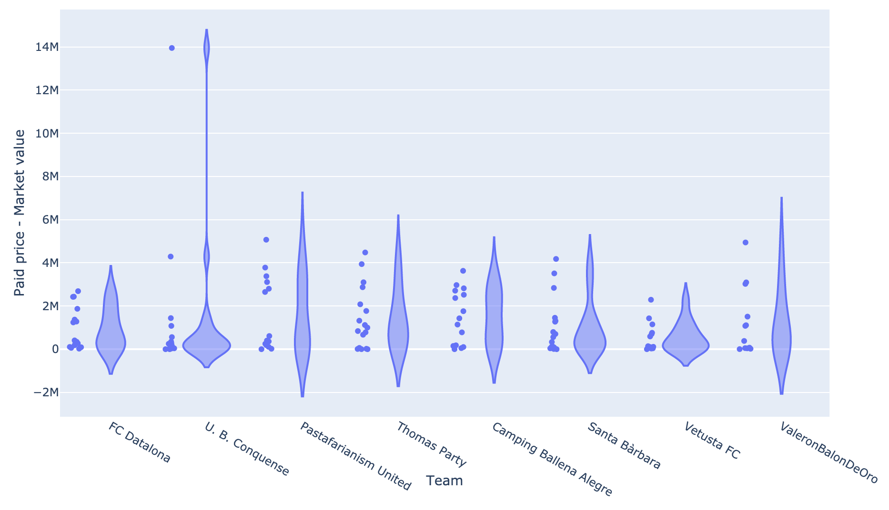
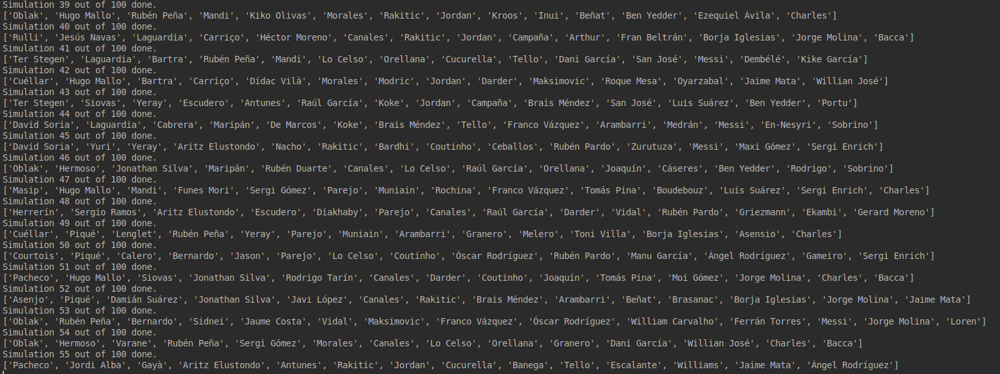
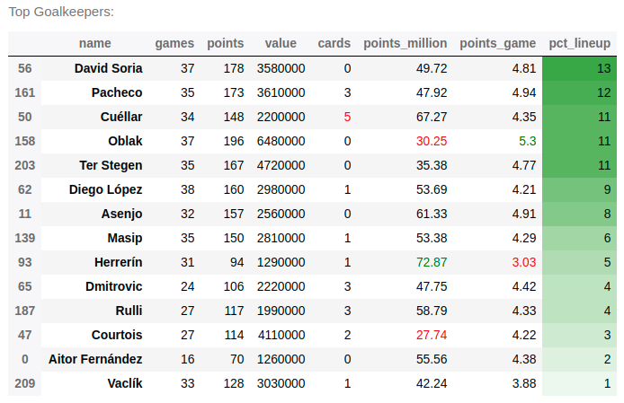
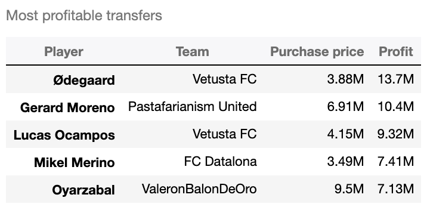
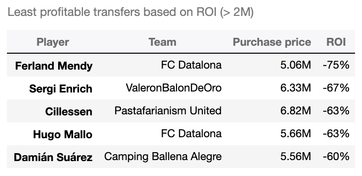
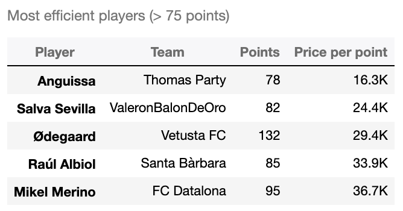
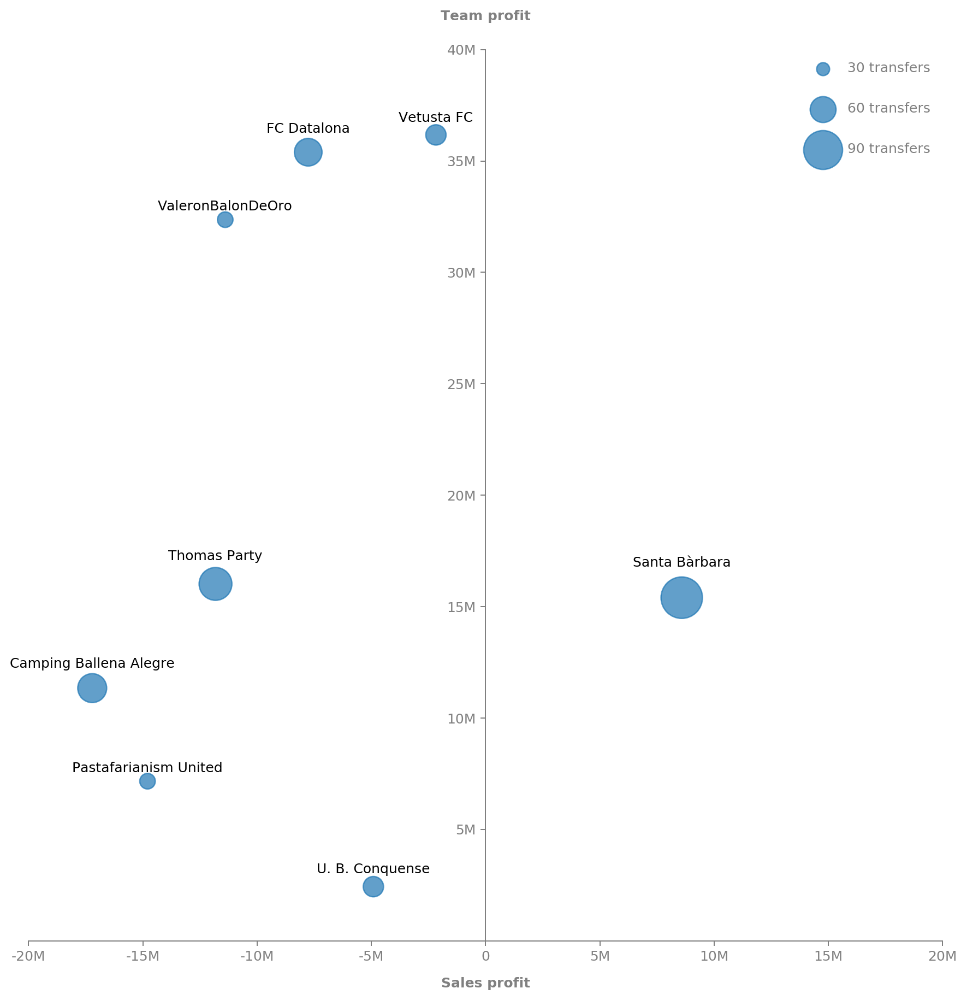

# fantasy-football-analysis

The purpose of this repository was to build a tool that helps Biwenger users to analyze the market based on how many and what type of players they need and how much money they have available, based on how players performed in the previous season. In addition, it allows to study how the other league participants tend to bid on players.

## 1 - Player Scraping

The first step is scraping last season's information about players in the league. Specifically, we will extract:
 - Name, team and position.
 - Number of games played.
 - Current market value.
 - Number of points.
 - Number of cards.
 - Number of goals.

In order to obtain a CSV, we should run the following command. Note that we are using Selenium with ChromeDriver, whose path must be added to _chrome_path_ in the _config.json_ file, along with the _email_ and _password_ required to log in to Biwenger.

`python3 scrape_biwenger.py -t market -l 1 -p 1`
 - -t (--scraper_type) specifies whether we want to scrape the players in the market (_market_ option) or our rival's teams (_users_ option).
 - -l (--league_index) is the number from 1 to _num_leagues_ from the ones that the user has joined.
 - -p (--start_page) is the number of the page where the scraper will start collecting information from.
 - -h (--headless) specifies whether the scraper will work in background or not. 

Then, once the _market.log_ is built, we should run the following command to turn the log file into a CSV file that makes the analysis easier:

`python3 parse_scraper_logs.py -t market -o players`
- -t (--log_type) specifies whether we are working with logs from the MarketScraper (_market_ option) or the TeamScraper (_users_ option).
- -o (--output_file) name of the CSV file.

Note that, because of the amount of requests we send to Biwenger, we will end up blacklisted so you may need to re-run the scraper several times, starting from the page where the scraper stopped the previous trial. In case of duplicates, the second command will drop them.

## 2 - User Analysis

### 2.1 - User scraping

Once we have all the information of the players, we need to know whether they are available to be bought or any other user in the league own them. For this reason and to be able to analyse how the rest of users bid, we will also scrape their teams.

In order to obtain a CSV, we should run the following command:

`python3 scrape_biwenger.py -t users -l 1`
 - -t (--scraper_type) specifies whether we want to scrape the players in the market (_market_ option) or our rival's teams (_users_ option).
 - -l (--league_index) is the number from 1 to _num_leagues_ from the ones that the user has joined.
 - -h (--headless) specifies whether the scraper will work in background or not. 

As we did before, we also need to run the parser to turn the .log file into a .csv:

`python3 parse_scraper_logs.py -t users -o users`

### 2.2 - User Analysis

The notebook called _User Analysis_ produces the following plot, that allows us to analyse how all the users in the league bid on players. Specifically we can see how much they tend to overpay in comparison to the market value. There is also the same plot as a percentage (i.e. relative to the price of the player). 

Finally, the notebook also allows to get the list of players that are not free to be bought, because they are own by any player in the league. This will be useful in the next section.

## 3 - Lineup Simulations

Now that we have information about how players performed last year, their current market value and the list of players who are available to be bought, we will run the genetic algorithm to obtain a set of ideal lineups.
I have implemented a meta-heuristic algorithm that tries to optimize the amount of points that a lineup would have achieved last season, taking into account a set of constraints, defined in a _biwenger.json_ file:
* Number of players needed per position.
* Amount of available money.
* Blacklist of players, where we should add players that we think they will not play this season or that are already own by other player in our league. 

Based on that, the simulation will be run X times and each time is composed by Y generations. In the initial generation, Z well-formed lineups (i.e. individuals) are randomly generated and for each generations, we do the following steps to the population:
* The population is split in elite and non-elite individuals based on their fitness value (i.e. sum of points)
* Some mutant individuals (new random elements) are generated
* There is a crossover process in which elite and non-elite individuals are mixed based on an _inheritance_probability_.

So at the end of the process, the population of the following generation is composed by the elite individuals of the previous one plus the ones created in the crossover and mutant processes. For more information, please check the following paper: https://link.springer.com/article/10.1007/s10732-010-9143-1

Specifically, for our problem, we have encoded the individuals as a chromosome with as many genes as players we want to have in the lineup, where each gene is the index of a player in the Pandas DataFrame of available players. In addition, we have configured the hyper-parameters of the BRKGA in the _config.json_ file with the following values:
* Number of generations: 50
* Number of individuals per generation: 50
* Proportion of elite individuals: 70%
* Proportion of mutant individuals: 20%
* Inheritance probability: 5%

The simulation should be run with this command:

`python3 simulate_lineup.py -l 3`
 - -l (--num_lineups) is the number of lineups that we take into account at the end of each simulation.

The idea is to check how many times each player in the data set appears in the ideal lineups so that we can use the probability of appearance as a percentage of recommendation.

 
## 4 - Market Analysis

The notebook called _Fantasy Football Analysis_ allows to analyze per position, what are the most recommendable players based on the previous probability of appearance in the ideal lineups and other values such as points per million or points per game played. In addition it provides other information like the amount of games, cards or goals they achieved last year.

The following plot per position allows to compare what players are more efficient per game or per million. The size of the bubble maps the percentage of recommendation and the colour is the market value.

## 5 - Transfer Analysis (NEW)

The notebook called _Transfers Analysis_ computes the profit generated by each transaction in the league. Allowing to know how much points a player has produced while he was in a user's team and how much its value has changed since the purchase. By using metrics like the ROI, I have discoverd what player have been more/less profitable in the league.

This plot compares what teams have improved their team's value either by buying and selling players (Sales profit) or by keeping players whose value has increased in their teams (Team profit).

## End notes

I am looking forward to listening to any suggestion for improvement, do not hesitate in contact me:

https://twitter.com/SergioMinuto90
sergio.llanaperez@gmail.com

